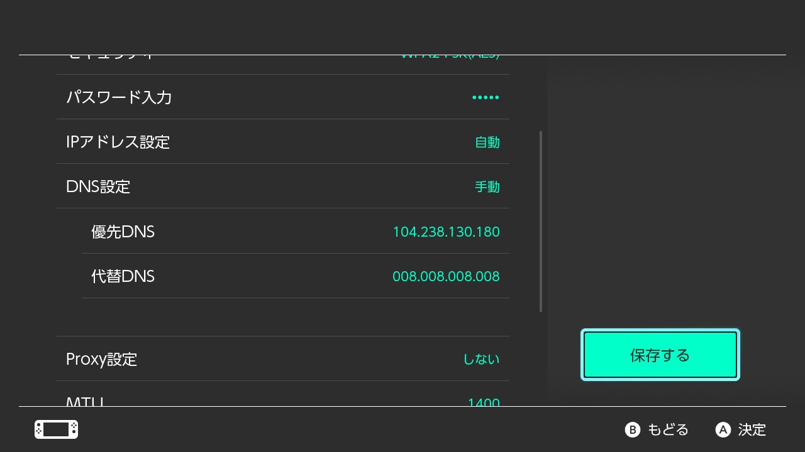

# サーバーの入り方

## サーバー参加の前に

このサーバーでは、
- ハッククライアントまたはそれに準ずるものの使用を含むチート行為
- 正規の方法で入手されていないアカウントでサーバーに接続すること

などを禁止しています。こうした行為がみられた場合、BANなどの対処をすることがあります。

サーバーの最新情報の受け取りや連携機能が使用できる[公式Discordコミュニティ](https://discord.gg/3cPMXcdGKd)への参加をご検討ください。（13歳以上のみ）

サーバーの入り方は、お使いの端末やMinecraftのエディションによって異なります。

## Java版マイクラ(Minecaft Java Edition)から

1. Minecraft Java Edition を起動し、タイトル画面の「マルチプレイ」を選択します。

2. 「サーバーを追加」を選択します。

3. >サーバー名：くろまるサーバー(自由に設定可能)  
   >サーバーアドレス：kuromaru.ml

   と入力して、「完了」を選択します。

## スマホ・タブレット・Windowsの統合版マイクラ(Minecraft)から
**サーバーへの接続には、Xbox Liveアカウントでのログインが必要です。**

今お使いの端末から参加したい場合、下のボタン・QRコードからすぐにサーバーリストに追加できます。

<a href="minecraft://?addExternalServer=くろまるサーバー|kuromaru.ml:19132"><Link className="button button--primary button--lg">サーバーリストに追加</Link></a>

### 手動で追加する場合

1. Minecraft を起動し、タイトル画面の「遊ぶ」を選択します。

2. 画面上部のタブから「サーバー」を選択して、表示されるサーバーリストの最下部にある「サーバーを追加」を選択します。

3. >サーバー名：くろまるサーバー(自由に設定可能)  
   >サーバーアドレス：kuromaru.ml  
   >ポート：入力しない(19132)

   と入力して、「完了」を選択します。

## コンソール(Switch/PS4/PS5)の統合版マイクラ(Minecraft)から

ほかの統合版マイクラ(Minecraft)と同様、サーバーへの接続にはXbox Liveアカウントでログインする必要があります。  
それに加えて、Nintendo Switchでサーバーにアクセスする場合はNintendo Switch Online、PlayStationシリーズからアクセスする場合はPlayStation Networkへの加入がそれぞれ必要です。

### 本体のDNS設定を変更する

現在、コンソール向けのMinecraftでは、そのままの状態では特集サーバー以外のサーバーに接続できないため、少し細工をします。

#### Nintendo Switchの場合

1. HOMEメニューから「設定」を選択します。

2. 左側のメニューから「インターネット」を選択し、「インターネット設定」に進みます。

3. 「登録済みのネットワーク」から、サーバーへの接続に使用するアクセスポイントを選択します。
    有線LANでインターネットに接続している場合は「有線接続」を選択します。

4. 「設定の変更」を選択し、表示される設定画面で「DNS設定」を「手動」に切り替えます。

   >優先DNS：104.238.130.180  
   >代替DNS：008.008.008.008

   に変更し、「保存する」を選択します。

### コンソール共通の設定

1. Minecraft を起動し、タイトル画面の「遊ぶ」を選択します。

2. 画面上部のタブから「サーバー」を選択して、サーバーリストに表示される「特集サーバー」のいずれかに参加する操作をします。

3. 「Server list」が表示されます。
    「Connect to a Server」を選択し、
   >Server Address: kuromaru.ml  
   >Server Port: 19132  
   >Display Name on Server List: (入力しない)  
   >Add to Server List: オンにする

   上記のように入力し、「送信」を選択します。

